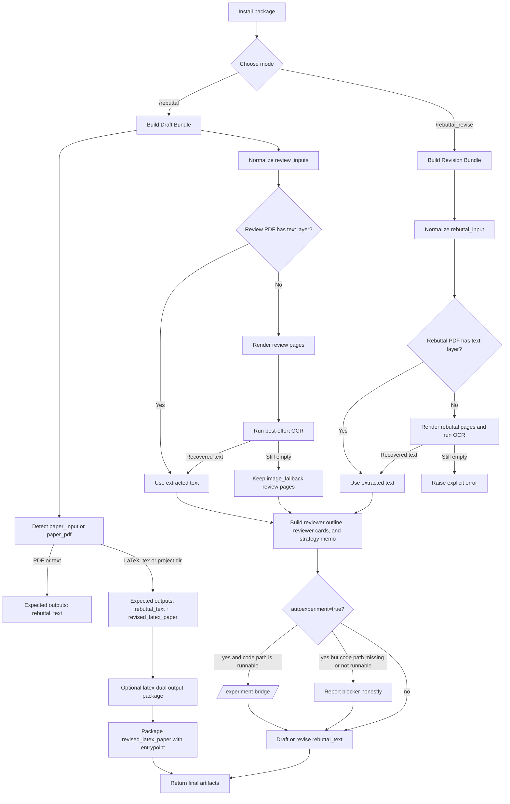

<div align="center">
  


[](./README.md)
[](./README.zh-CN.md)

</div>

# AutoRebuttal


AutoRebuttal is an evidence-first rebuttal workflow for coding agents. It parses papers and reviews, decomposes reviewer concerns, drafts venue-aware responses, and optionally routes empirical concerns into measured experiment loops with verifiable logs, metrics, and non-fabricated rebuttal insertion.

It is built for one job: help authors turn a paper, reviews, and explicit rebuttal constraints into a structured, evidence-first response without fabricating experiments, gains, or citations.

The current repo proves three paper-input lanes:

- paper PDF
- extracted or manually supplied paper text
- LaTeX paper input as either a single `.tex` file or a directory containing `.tex` files

Review inputs remain PDF or text. Revise mode still starts from an existing rebuttal PDF or rebuttal text. OCR support is limited to the implemented rendered-page fallback path in `skills/auto-rebuttal/scripts/`; this repo does not claim generic OCR or full LaTeX compilation/edit automation beyond the helpers that already exist.

The package exposes three command-style entrypoints:

- `/rebuttal` for drafting from paper + reviews
- `/rebuttal_revise` for polishing an existing rebuttal draft
- `/experiment-bridge` for supplementary evidence when reviewers ask for new experiments

## Why Evidence-First Rebuttal?

Review responses often fail in two opposite ways: they either overpromise new experiments that are not actually run, or they bury real evidence in unstructured logs that cannot be traced back to the rebuttal claim. AutoRebuttal keeps the drafting layer and evidence layer connected but separate.

The workflow can now represent a reviewer request as an `Experiment Request`, map it into a runnable `Experiment Packet`, run or materialize that packet, parse a metric, and write an `Evidence Ledger` entry. The ledger is the source of truth for experimental claims; rebuttal prose should only use verified claims or explicit placeholders.

## What AutoRebuttal Can And Cannot Do

AutoRebuttal can:

- parse papers, reviews, and existing rebuttals into structured drafting bundles
- classify empirical reviewer concerns such as ablations, baselines, runtime, robustness, datasets, metrics, and failure cases
- run a local shell experiment packet with a timeout and captured stdout/stderr
- parse JSON, CSV, or regex-log metrics into measured values
- compare a candidate metric with a baseline value when provided
- generate a Slurm `sbatch` script for CV/HPC-style dry runs
- write `results.tsv` or `results.jsonl` plus `evidence_ledger.json`

AutoRebuttal cannot:

- infer the correct training or evaluation command for an arbitrary project without author mapping
- guarantee that a cluster accepts a generated Slurm script
- prove that a model improved unless a real command, log, result file, and metric parser support the claim
- safely roll back arbitrary project edits without the author's version-control policy
- insert unverified experiment results into rebuttal prose as if they were verified

## AutoRebuttal Outputs

| Paper | Reviews | Venue | AutoRebuttal |
|---|---|---|---|
| [Paper A](/docs/110.pdf) | [Reviews A](/docs/11.pdf) | ICLR | [AutoRebuttal A](/docs/11_iclr.md) |
| [Paper B](/docs/120.pdf) | [Reviews B](/docs/12.pdf) | ICLR | [AutoRebuttal B](/docs/12_iclr.md) |
| [Paper C](/docs/130.pdf) | [Reviews C](/docs/13.pdf) | ICLR | [AutoRebuttal C](/docs/13_iclr.md) |
| [Paper D](/docs/140.pdf) | [Reviews D](/docs/14.pdf) | ICLR | [AutoRebuttal D](/docs/14_iclr.md) |
| [Paper E](/docs/150.pdf) | [Reviews E](/docs/15.pdf) | ICLR | [AutoRebuttal E](/docs/15_iclr.md) |

## Quick Install

### Codex

Tell Codex:

```text
Fetch and follow instructions from https://raw.githubusercontent.com/YoujunZhao/AutoRebuttal/refs/heads/main/.codex/INSTALL.md
```

### Claude Code

Install it through the Claude plugin workflow, use:

```text
/plugin marketplace add YoujunZhao/AutoRebuttal
/plugin install auto-rebuttal@auto-rebuttal-dev
```
## Other installation

### Codex

Preferred path: native skill discovery via clone + junction / symlink.

Clone the repo:

```bash
git clone https://github.com/YoujunZhao/AutoRebuttal.git ~/.codex/AutoRebuttal
```

Create the skill symlink:

```bash
mkdir -p ~/.agents/skills
ln -s ~/.codex/AutoRebuttal/skills/auto-rebuttal ~/.agents/skills/auto-rebuttal
```

Windows (PowerShell):

```powershell
New-Item -ItemType Directory -Force -Path "$env:USERPROFILE\.agents\skills"
cmd /c mklink /J "$env:USERPROFILE\.agents\skills\auto-rebuttal" "$env:USERPROFILE\.codex\AutoRebuttal\skills\auto-rebuttal"
```

Update through the clone:

```bash
cd ~/.codex/AutoRebuttal && git pull
```

Optional manager CLI path:

```bash
python scripts/autorebuttal_manager.py codex install
python scripts/autorebuttal_manager.py codex update
python scripts/autorebuttal_manager.py codex remove
```

Full details are documented in [`.codex/INSTALL.md`](.codex/INSTALL.md).

### Claude Code

The repository includes a Claude-style plugin shell:

- [`.claude-plugin/plugin.json`](.claude-plugin/plugin.json)
- [`.claude-plugin/marketplace.json`](.claude-plugin/marketplace.json)

The manager CLI follows the Claude plugin command model and prints the commands you should run:

```bash
python scripts/autorebuttal_manager.py claude install
python scripts/autorebuttal_manager.py claude update
python scripts/autorebuttal_manager.py claude remove
```

## How To Use It

After installation, there are three practical invocation styles:

- **Use the `rebuttal` command**
- **Use the `/rebuttal_revise` command**
- **Use the `auto-rebuttal` skill**

The quickest examples are:

Draft from `paper PDF + review PDF`:

```text
/rebuttal venue=ICML per_reviewer=5000
```

Draft from `paper PDF + review PDF`, and auto-run supplementary experiments when reviewers ask for new evidence:

```text
/rebuttal venue=ICML per_reviewer=5000 autoexperiment=true code=./project
```

Draft from `LaTeX paper + review text`, returned as Markdown:

```text
/rebuttal venue=ICML per_reviewer=5000 output=md
```

Draft from `paper PDF + review PDF + review text`:

```text
/rebuttal venue=ICML per_reviewer=5000
```

Revise from `rebuttal PDF`, with optional `paper PDF` or `LaTeX paper`, and keep Markdown formatting:

```text
/rebuttal_revise venue=ICML per_reviewer=5000 output=md autoexperiment=true code=./project
```

Run the evidence lane directly:

```text
/experiment-bridge autoexperiment=true code=./project
```

Use the `auto-rebuttal` skill directly:

```text
Use the `auto-rebuttal` skill. Treat ./paper as a LaTeX paper source, accept review PDF or review text inputs, and return output=md.
```

## Parameters

This README keeps the user-facing parameter surface intentionally small.

| Parameter | Category | Optional | Purpose |
| --- | --- | --- | --- |
| `rebuttal` / `rebuttal_revise` | command parameter | no | Select whether the workflow drafts from paper + reviews or revises an existing rebuttal. |
| `venue` | venue parameter | yes | Applies venue-specific defaults such as ICML, NeurIPS, AAAI, IEEE, CVPR, ICCV, and ECCV. |
| `per_reviewer` | per-reviewer parameter | yes | Sets an explicit per-reviewer character budget. IEEE keeps per-reviewer mode but leaves the default limit unset. |
| `autoexperiment` | experiment parameter | yes | Auto-run supplementary experiments via `/experiment-bridge` when reviewers ask for new evidence. The default is `false`. |
| `code` | code parameter | yes | Supplies the project code path. Experiments only run when both `autoexperiment=true` and `code=<path>` are provided. |
| `output` | presentation parameter | yes | Selects the final presentation format. Use `text` for plain text or `md` for Markdown. The default is `text`. |

## How It Works

AutoRebuttal starts from the moment an author brings a paper and reviews into the session. Instead of jumping straight to final prose, it first identifies the response format, organizes the review concerns, builds a reviewer outline, models reviewer stance and attitude, builds a global strategy memo, and only then drafts or revises.

The repo-level workflow is:



In practice, the flow is:

1. install the package in the host tool
2. provide manuscript context as a paper PDF, paper text, or LaTeX paper
3. provide review PDFs, review text, rebuttal PDFs, or rebuttal text depending on mode
4. auto-detect whether each non-paper artifact is PDF or text
5. extract PDF text first, then use rendered-page OCR if extraction fails
6. keep review PDFs as `image_fallback` page sets if OCR still yields no usable text
7. fail clearly in revise mode if a rebuttal PDF still has no usable text after OCR
8. build a reviewer outline with `W#`, `Q#`, and minor-point structure when the review supports it
9. build reviewer cards with reviewer stance, movability, attitude, and primary concerns
10. produce a global strategy memo before reviewer-by-reviewer prose
11. if `autoexperiment=true` and reviewers ask for new evidence, route those requests through `/experiment-bridge` only when `code=<path>` points to a runnable project workspace
12. allocate the character budget before drafting
13. return `rebuttal_text`, and for LaTeX paper inputs also target `revised_latex_paper`

For LaTeX paper inputs, the repo-level output contract remains:

- `rebuttal_text`
- `revised_latex_paper`

## Experiment Loop Overview

The v2 experiment loop is intentionally small and measurable:

1. extract or write an `Experiment Request` from reviewer text
2. map it into an `Experiment Packet` with a command, timeout, metric parser, baseline, allowed/forbidden paths, and rebuttal usage
3. run the packet locally or generate a Slurm script
4. capture stdout/stderr under `logs/experiments/`
5. parse a JSON, CSV, or log metric
6. compare the candidate metric with the baseline when one is available
7. write a decision: `keep`, `discard`, `crash`, `timeout`, `checks_failed`, or `inconclusive`
8. append `results.tsv` or `results.jsonl`
9. upsert `evidence_ledger.json`

The runner records failed and inconclusive packets too, because those outcomes are evidence about what should not be claimed.

## Experiment Request vs Experiment Packet vs Evidence Ledger

An `Experiment Request` is the review-facing need, for example `R2-W3` asking for an ablation. Its schema lives at [`skills/auto-rebuttal/schemas/experiment_request.schema.json`](skills/auto-rebuttal/schemas/experiment_request.schema.json).

An `Experiment Packet` is the runnable unit. It contains the hypothesis, command, launcher, timeout, metric parser, baseline, file contract, output files, and rollback preference. Its schema lives at [`skills/auto-rebuttal/schemas/experiment_packet.schema.json`](skills/auto-rebuttal/schemas/experiment_packet.schema.json).

The `Evidence Ledger` is the rebuttal-facing provenance store. Every experimental claim should point to a request id, packet id, command, commits when available, metric before/after, result files, log files, and a conservative rebuttal sentence. Its schema lives at [`skills/auto-rebuttal/schemas/evidence_ledger.schema.json`](skills/auto-rebuttal/schemas/evidence_ledger.schema.json).

Examples:

- [`skills/auto-rebuttal/examples/experiment_request.example.json`](skills/auto-rebuttal/examples/experiment_request.example.json)
- [`skills/auto-rebuttal/examples/experiment_packet.example.json`](skills/auto-rebuttal/examples/experiment_packet.example.json)
- [`skills/auto-rebuttal/examples/evidence_ledger.example.json`](skills/auto-rebuttal/examples/evidence_ledger.example.json)

## Local Runner Usage

Validate a packet:

```bash
python3 skills/auto-rebuttal/scripts/validate_experiment_plan.py \
  skills/auto-rebuttal/examples/experiment_packet.example.json
```

Run a local packet:

```bash
python3 skills/auto-rebuttal/scripts/run_experiment_packet.py \
  skills/auto-rebuttal/examples/experiment_packet.example.json \
  --results results.tsv \
  --ledger evidence_ledger.json
```

The local runner:

- checks the declared file contract for forbidden-path references
- runs the command with the packet timeout
- stores stdout/stderr under `logs/experiments/`
- parses the configured metric
- compares against `baseline.metric_value` when provided
- appends the result row and updates the ledger

## Slurm Runner Usage

For HPC/CV experiments, set `"launcher": "slurm"` and add a `slurm` object to the packet:

```json
{
  "slurm": {
    "partition": "gpu",
    "account": "project-account",
    "gres": "gpu:1",
    "cpus_per_task": 8,
    "mem": "32G",
    "time": "02:00:00",
    "conda_env": "paper",
    "output_log_path": "logs/slurm-%j.out"
  }
}
```

The current Slurm adapter generates an `sbatch` script as a dry-run artifact. It does not submit jobs, poll schedulers, or assume cluster-specific modules.

## Non-Fabrication Policy

AutoRebuttal must not turn an unverified packet into a factual rebuttal claim. The runner writes a ledger entry for every packet outcome, but only `keep` produces a verified rebuttal sentence. `discard`, `crash`, `timeout`, `checks_failed`, and `inconclusive` entries should be used as blockers, placeholders, or internal notes.

Acceptable rebuttal usage:

- verified ledger claim: "The ablation reduced LPIPS from 0.231 to 0.218 under packet `R2-W3-ablation-depth`."
- unverified packet: "`[RESULT-TO-FILL]` once the ablation packet completes."
- failed packet: "We cannot claim this experiment yet; the run crashed or did not produce a parseable metric."

## Example Workflow

1. Build or write an experiment request from reviewer feedback.
2. Convert it into a packet with `build_experiment_plan.py`, then author-fill the command, metric, and baseline.
3. Validate the packet with `validate_experiment_plan.py`.
4. Run the packet with `run_experiment_packet.py`.
5. Inspect `results.tsv`, logs, and `evidence_ledger.json`.
6. Use only verified ledger sentences in the rebuttal draft; keep placeholders for everything else.

## Human-Like Rebuttal Layer

AutoRebuttal includes:

- **reviewer cards** for reviewer stance, movability, attitude, and primary concerns
- a **global strategy memo** to decide what should lead the rebuttal
- explicit **character-budget planning** so the opening, body, and closing are sized before drafting
- a **block formatter** so `W1`, `Q1`, and `M1` start on their own line

This is the main difference between the workflow and a generic "write me a rebuttal" prompt.

That also means the workflow tries to identify:

- which reviewers are swing reviewers
- which concerns are global themes across multiple reviewers
- where the draft should reassure, clarify, de-escalate, or sharply distinguish prior work

## Venue-Aware Formatting Defaults

- **ICLR**
  uses a brief global summary first, then reviewer blocks
- **ICML**
  uses reviewer blocks only, with a `5000`-character per-reviewer default
- **NeurIPS**
  uses reviewer blocks only, with a `10000`-character per-reviewer default
- **AAAI**
  uses reviewer blocks only, with a `2500`-character per-reviewer project preset
- **IEEE**
  uses reviewer blocks only, with per-reviewer mode and no default character limit
- **CVPR / ICCV / ECCV**
  use a brief summary to all reviewers first, then reviewer blocks, and budget the response like a one-page rebuttal-PDF equivalent

Inside each reviewer block, the formatter should prefer `W1 / W2 / W3` point-to-point responses instead of one merged paragraph.
Each `W1`, `Q1`, and `M1` label should start on its own line.

It should also support:

- `Q1 / Q2 / Q3` for direct reviewer questions
- short `M1 / M2 / M3` responses for minor points
- or one merged `Minor points` section when several minor comments are highly similar

For OpenReview-style review exports, the parser should preserve headers such as `Main Weaknesses`, `Key Questions For Authors`, and `Minor Weaknesses` instead of flattening everything into `W#`.

When a reviewer asks for empirical evidence, the formatter can insert an experiment placeholder table with `XX` values instead of fabricated numbers.

User-supplied parameters always override these venue defaults. If the user gives `per_reviewer=5000`, `shared_total=6000`, or `global_summary=false`, those instructions win even when the venue preset says otherwise.

## Verified Support Today

These are the things the project can present as verified support today:

- repo-level manager CLI via [`scripts/autorebuttal_manager.py`](scripts/autorebuttal_manager.py)
- Codex installation via [`.codex/INSTALL.md`](.codex/INSTALL.md)
- Claude plugin shell metadata via [`.claude-plugin/plugin.json`](.claude-plugin/plugin.json)
- local Claude marketplace metadata via [`.claude-plugin/marketplace.json`](.claude-plugin/marketplace.json)
- command entrypoints via [`commands/rebuttal.md`](commands/rebuttal.md) and [`commands/rebuttal_revise.md`](commands/rebuttal_revise.md)
- supplementary experiment routing via [`commands/experiment-bridge.md`](commands/experiment-bridge.md)
- draft and revision bundle builders via [`skills/auto-rebuttal/scripts/build_draft_bundle.py`](skills/auto-rebuttal/scripts/build_draft_bundle.py) and [`skills/auto-rebuttal/scripts/build_revision_bundle.py`](skills/auto-rebuttal/scripts/build_revision_bundle.py)
- experiment request extraction via [`skills/auto-rebuttal/scripts/build_experiment_request_bundle.py`](skills/auto-rebuttal/scripts/build_experiment_request_bundle.py)
- experiment request, packet, and evidence ledger schemas via [`skills/auto-rebuttal/schemas/`](skills/auto-rebuttal/schemas/)
- local experiment packet runner via [`skills/auto-rebuttal/scripts/run_experiment_packet.py`](skills/auto-rebuttal/scripts/run_experiment_packet.py)
- metric parsing for JSON, CSV, and regex logs via [`skills/auto-rebuttal/adapters/`](skills/auto-rebuttal/adapters/)
- dry-run Slurm `sbatch` script generation via [`skills/auto-rebuttal/adapters/slurm.py`](skills/auto-rebuttal/adapters/slurm.py)
- evidence ledger updates via [`skills/auto-rebuttal/scripts/update_evidence_ledger.py`](skills/auto-rebuttal/scripts/update_evidence_ledger.py)
- paper artifact detection for PDF, text, single `.tex` files, and LaTeX project directories via [`skills/auto-rebuttal/scripts/detect_paper_artifact.py`](skills/auto-rebuttal/scripts/detect_paper_artifact.py)
- best-effort rendered-page OCR fallback for PDFs via [`skills/auto-rebuttal/scripts/ocr_rendered_pages.py`](skills/auto-rebuttal/scripts/ocr_rendered_pages.py) and [`skills/auto-rebuttal/scripts/render_review_pdf_pages.py`](skills/auto-rebuttal/scripts/render_review_pdf_pages.py)
- a LaTeX output package helper via [`skills/auto-rebuttal/scripts/build_latex_output_package.py`](skills/auto-rebuttal/scripts/build_latex_output_package.py)
- `per-reviewer mode`
- `shared-global mode`
- `/experiment-bridge` as a bounded supplementary-evidence lane

## Checked Reference Notes

The repository also includes checked public reference notes for:

- ICLR
- NeurIPS
- ICML
- ARR-style author responses

Those notes live in [`skills/auto-rebuttal/references/venue-policies.md`](skills/auto-rebuttal/references/venue-policies.md).

That is intentionally weaker than saying "full venue support." These notes are reference material, not a promise that every year and every venue-specific rebuttal form is fully automated or fully tested.

## What's Inside

### Package Shell

- [`scripts/autorebuttal_manager.py`](scripts/autorebuttal_manager.py)
- [`.codex/INSTALL.md`](.codex/INSTALL.md)
- [`.claude-plugin/plugin.json`](.claude-plugin/plugin.json)
- [`.claude-plugin/marketplace.json`](.claude-plugin/marketplace.json)
- [`commands/rebuttal.md`](commands/rebuttal.md)
- [`commands/rebuttal_revise.md`](commands/rebuttal_revise.md)
- [`commands/experiment-bridge.md`](commands/experiment-bridge.md)

### Canonical Rebuttal Engine

- [`skills/auto-rebuttal/SKILL.md`](skills/auto-rebuttal/SKILL.md)
- [`skills/auto-rebuttal/scripts/build_input_bundle.py`](skills/auto-rebuttal/scripts/build_input_bundle.py)
- [`skills/auto-rebuttal/scripts/build_draft_bundle.py`](skills/auto-rebuttal/scripts/build_draft_bundle.py)
- [`skills/auto-rebuttal/scripts/build_revision_bundle.py`](skills/auto-rebuttal/scripts/build_revision_bundle.py)
- [`skills/auto-rebuttal/scripts/build_experiment_request_bundle.py`](skills/auto-rebuttal/scripts/build_experiment_request_bundle.py)
- [`skills/auto-rebuttal/scripts/build_experiment_plan.py`](skills/auto-rebuttal/scripts/build_experiment_plan.py)
- [`skills/auto-rebuttal/scripts/validate_experiment_plan.py`](skills/auto-rebuttal/scripts/validate_experiment_plan.py)
- [`skills/auto-rebuttal/scripts/run_experiment_packet.py`](skills/auto-rebuttal/scripts/run_experiment_packet.py)
- [`skills/auto-rebuttal/scripts/parse_experiment_result.py`](skills/auto-rebuttal/scripts/parse_experiment_result.py)
- [`skills/auto-rebuttal/scripts/update_evidence_ledger.py`](skills/auto-rebuttal/scripts/update_evidence_ledger.py)
- [`skills/auto-rebuttal/scripts/build_latex_output_package.py`](skills/auto-rebuttal/scripts/build_latex_output_package.py)
- [`skills/auto-rebuttal/scripts/render_review_pdf_pages.py`](skills/auto-rebuttal/scripts/render_review_pdf_pages.py)
- [`skills/auto-rebuttal/scripts/ocr_rendered_pages.py`](skills/auto-rebuttal/scripts/ocr_rendered_pages.py)
- [`skills/auto-rebuttal/scripts/build_reviewer_outline.py`](skills/auto-rebuttal/scripts/build_reviewer_outline.py)
- [`skills/auto-rebuttal/scripts/build_reviewer_cards.py`](skills/auto-rebuttal/scripts/build_reviewer_cards.py)
- [`skills/auto-rebuttal/scripts/response_modes.py`](skills/auto-rebuttal/scripts/response_modes.py)
- [`skills/auto-rebuttal/scripts/install_skill.py`](skills/auto-rebuttal/scripts/install_skill.py)
- [`skills/auto-rebuttal/scripts/package_skill.py`](skills/auto-rebuttal/scripts/package_skill.py)
- [`skills/auto-rebuttal/scripts/validate_budget.py`](skills/auto-rebuttal/scripts/validate_budget.py)

### Reference Material

- [`skills/auto-rebuttal/references/input-contract.md`](skills/auto-rebuttal/references/input-contract.md)
- [`skills/auto-rebuttal/references/experiment-loop.md`](skills/auto-rebuttal/references/experiment-loop.md)
- [`skills/auto-rebuttal/references/evidence-ledger.md`](skills/auto-rebuttal/references/evidence-ledger.md)
- [`skills/auto-rebuttal/references/rebuttal-playbook.md`](skills/auto-rebuttal/references/rebuttal-playbook.md)
- [`skills/auto-rebuttal/references/venue-policies.md`](skills/auto-rebuttal/references/venue-policies.md)
- [`skills/auto-rebuttal/references/source-notes.md`](skills/auto-rebuttal/references/source-notes.md)

### Tests

- [`tests/test_plugin_surface.py`](tests/test_plugin_surface.py)
- [`tests/test_response_modes.py`](tests/test_response_modes.py)
- [`tests/test_install_wrappers.py`](tests/test_install_wrappers.py)

## Generic Fallback for Unsupported Venues

If the venue is not clearly covered, or if the venue rules for the current year are uncertain, do not pretend the package has a built-in template. Instead, provide an explicit budget and continue in generic mode:

- `per-reviewer mode`
- `shared-global mode`

This is the intended fallback behavior for unsupported or unverified venues.

## Limitations

- It does not infer arbitrary project-specific experiment commands; authors must map reviewer requests into runnable packets.
- It does not guarantee that `/experiment-bridge` can execute inside every repository; if `code` is missing or no runnable experiment workspace exists, it returns blockers instead of fake results.
- It does not submit Slurm jobs; the current adapter generates `sbatch` scripts for dry-run review.
- It does not perform destructive rollback. Failed packets are marked `discard`, `crash`, `timeout`, `checks_failed`, or `inconclusive` and can recommend rollback, but the author or project automation must decide how to revert files.
- It does not fetch private reviews from submission systems.
- It does not claim support for every conference rebuttal format.
- It does not claim that checked venue notes are the same as tested venue automation.
- It does not claim public official Claude marketplace publication.
- It does not guarantee score improvement.
- OCR is best-effort after rendered-page conversion; some scanned PDFs will still end as `image_fallback` in draft mode or a hard error in rebuttal-revise mode.
- LaTeX support is limited to detecting `.tex` or LaTeX project inputs, preserving `entrypoint` and `latex_sources`, and packaging `revised_latex_paper`; the repo does not prove TeX compilation or automatic multi-file patch synthesis.

## Research Basis

The workflow is grounded in:

- public venue instructions
- public rebuttal studies and datasets
- explicit non-fabrication rules

Start here:

- [`skills/auto-rebuttal/references/source-notes.md`](skills/auto-rebuttal/references/source-notes.md)
- [`skills/auto-rebuttal/references/rebuttal-playbook.md`](skills/auto-rebuttal/references/rebuttal-playbook.md)
- [`skills/auto-rebuttal/references/input-contract.md`](skills/auto-rebuttal/references/input-contract.md)

## Project Status

- private-first
- plugin-first
- narrow by design in what it claims
- stronger on workflow discipline than on venue-specific automation
