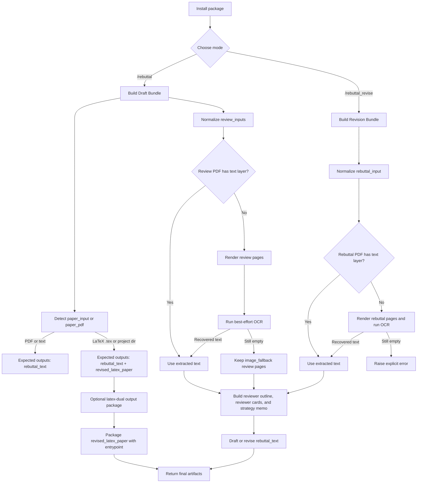

# AutoRebuttal

[English README](README.md)

AutoRebuttal 是一个面向 coding agent 的 rebuttal workflow package。仓库里的代码和测试目前已经证明这些能力：

- `paper PDF`
- `paper text`
- `LaTeX paper`
- `review PDF`
- `review text`
- `rebuttal PDF`
- `rebuttal text`

OCR 只应理解为当前仓库里已经实现的 rendered-page fallback 路径，不应被理解成“任意 PDF 都稳定识别”的泛化能力。

## Installation

## Quick Install

### Codex

直接告诉 Codex：

```text
Fetch and follow instructions from https://raw.githubusercontent.com/YoujunZhao/AutoRebuttal/refs/heads/main/.codex/INSTALL.md
```

### Claude Code

通过 Claude plugin workflow 安装：

```text
/plugin marketplace add YoujunZhao/AutoRebuttal
/plugin install auto-rebuttal@auto-rebuttal-dev
```

## Other installation

### Codex

推荐路径是和 Superpowers 一样的原生 skill 发现方式：

1. clone 仓库
2. 建一个 skill junction / symlink
3. 重启 Codex

```bash
git clone https://github.com/YoujunZhao/AutoRebuttal.git ~/.codex/AutoRebuttal
```

```bash
mkdir -p ~/.agents/skills
ln -s ~/.codex/AutoRebuttal/skills/auto-rebuttal ~/.agents/skills/auto-rebuttal
```

Windows (PowerShell):

```powershell
New-Item -ItemType Directory -Force -Path "$env:USERPROFILE\.agents\skills"
cmd /c mklink /J "$env:USERPROFILE\.agents\skills\auto-rebuttal" "$env:USERPROFILE\.codex\AutoRebuttal\skills\auto-rebuttal"
```

更新：

```bash
cd ~/.codex/AutoRebuttal && git pull
```

如果你还是想用 Python helper，也保留了 optional manager CLI：

```bash
python scripts/autorebuttal_manager.py codex install
python scripts/autorebuttal_manager.py codex update
python scripts/autorebuttal_manager.py codex remove
```

### Claude Code

```bash
python scripts/autorebuttal_manager.py claude install
python scripts/autorebuttal_manager.py claude update
python scripts/autorebuttal_manager.py claude remove
```

## How To Use It

Examples：

```text
/rebuttal venue=ICML per_reviewer=5000
Input: paper PDF + review PDF
```

```text
/rebuttal venue=ICML per_reviewer=5000
Input: LaTeX paper + review text
```

```text
/rebuttal venue=ICML per_reviewer=5000
Input: paper PDF + review PDF + review text
```

```text
/rebuttal_revise venue=ICML per_reviewer=5000
Input: rebuttal PDF + optional paper PDF / LaTeX paper
```

## Parameters

| Parameter | 分类 | Optional | 作用 |
| --- | --- | --- | --- |
| `rebuttal` / `rebuttal_revise` | command parameter | no | 选择是从 paper + reviews 起草，还是对 existing rebuttal 做 revise。 |
| `venue` | venue parameter | yes | 应用 ICML / NeurIPS / AAAI / IEEE / CVPR / ICCV / ECCV 等默认格式。 |
| `per_reviewer` | per-reviewer parameter | yes | 指定每个 reviewer 的字符预算。IEEE 默认是 per-reviewer，但不预设字符上限。 |

## How It Works



## Venue-Aware Formatting Defaults

- **ICLR**
  默认先给一小段 global summary，再进入 reviewer blocks
- **ICML**
  默认不加总述，直接 reviewer blocks，默认 `5000` 字符 / reviewer
- **NeurIPS**
  默认不加总述，直接 reviewer blocks，默认 `10000` 字符 / reviewer
- **AAAI**
  默认不加总述，直接 reviewer blocks，默认 `2500` 字符 / reviewer
- **IEEE**
  默认 `per-reviewer`，不预设字符上限
- **CVPR / ICCV / ECCV**
  默认先给所有 reviewer 的 summary，再进入 reviewer blocks，并按一页 rebuttal PDF 左右的规模规划

point-to-point 结构继续支持：

- `W1`
- `Q1`
- `minor` / `M1`

如果 reviewer 需要实验支持，仍然用 `XX` 或 experiment placeholder table。

## LaTeX Paper Contract

如果 `paper_input` 是 LaTeX，workflow 输出 contract 变成：

- `rebuttal_text`
- `revised_latex_paper`

当前支持的是：

- 识别 `.tex`
- 识别 LaTeX 项目目录
- 保留 `entrypoint`
- 保留 `latex_sources`
- 输出 `revised_latex_paper`

## Human-Like Rebuttal Layer

AutoRebuttal 仍然会构建：

- reviewer outline
- reviewer cards
- global strategy

## Limitations

- 不会运行实验
- 不会自动抓取投稿系统中的私有 reviews
- 不会为没有证据的结论编造数字
- OCR 是 best-effort
- IEEE 这里实现的是项目 preset，不代表所有 IEEE venue / 年份规则都完全一致
