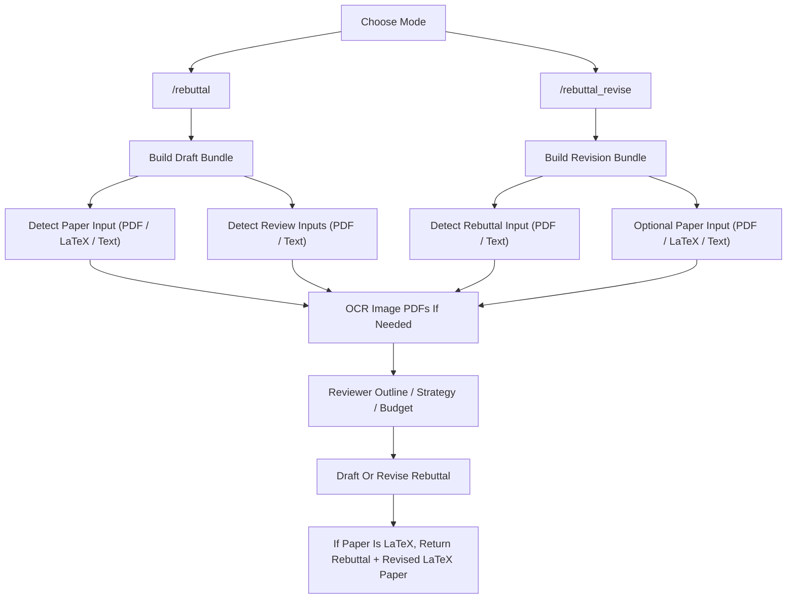

# AutoRebuttal

[English README](README.md)

AutoRebuttal 是一个面向 coding agent 的 rebuttal workflow package。

它支持：

- `paper PDF`
- `paper LaTeX`：单个 `.tex` 或 LaTeX 项目目录
- `review PDF`
- `review text`
- `rebuttal PDF`
- `rebuttal text`

## Installation

### Codex

```bash
python scripts/autorebuttal_manager.py codex install
python scripts/autorebuttal_manager.py codex update
python scripts/autorebuttal_manager.py codex remove
```

### Claude Code

```bash
python scripts/autorebuttal_manager.py claude install
python scripts/autorebuttal_manager.py claude update
python scripts/autorebuttal_manager.py claude remove
```

对应的 plugin 命令：

```text
/plugin marketplace add YoujunZhao/AutoRebuttal
/plugin install auto-rebuttal@auto-rebuttal-dev
```

## How To Use It

最直接的调用方式就是：

```text
/rebuttal venue=ICML per_reviewer=5000
```

```text
/rebuttal_revise venue=ICML per_reviewer=5000
```

Examples：

起草，输入 `paper PDF + review PDF`：

```text
/rebuttal venue=ICML per_reviewer=5000
Input: paper PDF + review PDF
```

起草，输入 `LaTeX paper + review text`：

```text
/rebuttal venue=ICML per_reviewer=5000
Input: LaTeX paper + review text
```

起草，输入 `paper PDF + review PDF + review text`：

```text
/rebuttal venue=ICML per_reviewer=5000
Input: paper PDF + review PDF + review text
```

润色，输入 `rebuttal PDF + optional paper PDF / LaTeX paper`：

```text
/rebuttal_revise venue=ICML per_reviewer=5000
Input: rebuttal PDF + optional paper PDF / LaTeX paper
```

## Parameters

这里只保留用户真正会传的三类参数。

| Parameter | 分类 | Optional | 作用 |
| --- | --- | --- | --- |
| `rebuttal` / `rebuttal_revise` | rebuttal / rebuttal revise 参数 | no | 选择是从 paper + reviews 起草，还是对 existing rebuttal 做 revise。 |
| `venue` | venue 参数 | yes | 应用 ICML / NeurIPS / AAAI / IEEE / CVPR / ICCV / ECCV 等默认格式。 |
| `per_reviewer` | per-reviewer 参数 | yes | 指定每个 reviewer 的字符预算。IEEE 默认是 per-reviewer，但不预设字符上限。 |

## Workflow



## Venue-Aware Formatting Defaults

- **ICLR**
  默认先给一小段 global summary，再进入 reviewer blocks
- **ICML**
  默认不加总述，直接 reviewer blocks，默认 `5000` 字符 / reviewer
- **NeurIPS**
  默认不加总述，直接 reviewer blocks，默认 `10000` 字符 / reviewer
- **AAAI**
  默认不加总述，直接 reviewer blocks，默认 `2500` 字符 / reviewer
- **IEEE**
  默认 `per-reviewer`，不预设字符上限
- **CVPR / ICCV / ECCV**
  默认先给所有 reviewer 的 summary，再进入 reviewer blocks，并按一页 rebuttal PDF 左右的规模规划

`W1`、`Q1`、`M1` 默认都应该单独占一行。这里的 `M1` 对应的就是 `minor` / minor points。

如果 reviewer 需要实验支持，仍然用 `XX` 或 experiment placeholder table，而不是编造数字。

## LaTeX Paper Contract

如果 `paper_input` 是 LaTeX，workflow 输出 contract 变成：

- `rebuttal_text`
- `revised_latex_paper`

当前支持的是：

- 识别 `.tex`
- 识别 LaTeX 项目目录
- 保留 `entrypoint`
- 保留 `latex_sources`
- 输出 `revised_latex_paper`

当前不声称支持：

- 自动编译 TeX
- 自动修复整套 LaTeX 工程
- 多文件工程的编译保证

## Limitations

- 不会运行实验
- 不会自动抓取投稿系统中的私有 reviews
- 不会为没有证据的结论编造数字
- OCR 是 best-effort
- IEEE 这里实现的是项目预设，不代表所有 IEEE venue 年份规则都完全一致
