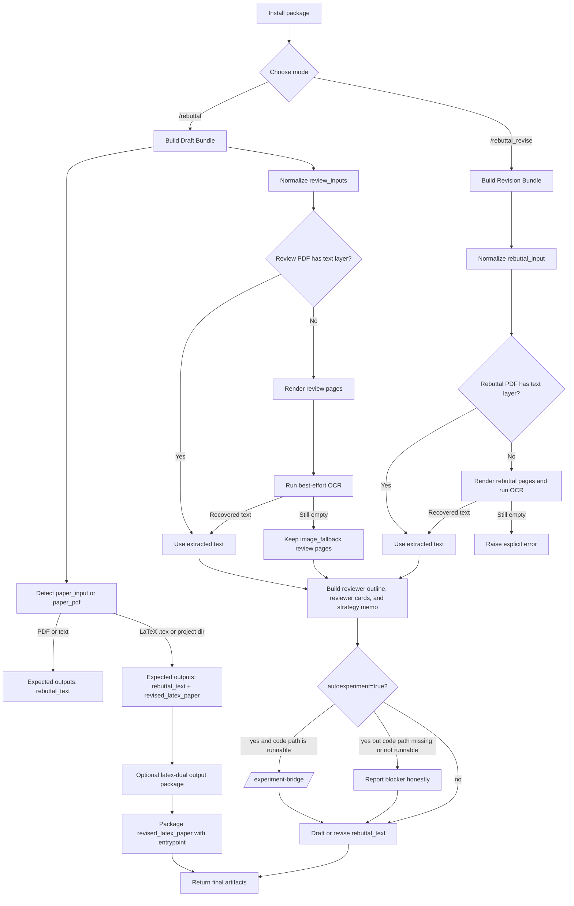

# AutoRebuttal

[English README](README.md)

AutoRebuttal 是一个面向 coding agent 的 rebuttal workflow package。这个仓库包含安装入口、内部 `auto-rebuttal` skill、命令入口、参考资料，以及定义当前项目真实能力边界的测试。

它只做一件事：帮助作者把论文、reviews 和明确的 rebuttal 约束整理成结构化、证据优先、且不编造实验结果、提升幅度或引用的回复。

当前仓库已经证明三种 paper 输入路径：

- paper PDF
- 抽取后的 paper text，或手动提供的 manuscript text
- LaTeX paper，既支持单个 `.tex` 文件，也支持包含 `.tex` 文件的目录

review 输入仍然是 PDF 或 text。`revise` 模式仍然从已有 rebuttal PDF 或 rebuttal text 开始。OCR 只限于 `skills/auto-rebuttal/scripts/` 里已经实现的 rendered-page fallback 路径；这个仓库并不宣称支持任意 OCR，也不宣称已经实现完整的 LaTeX 编译或自动多文件重写。

当前项目暴露三个命令式入口：

- `/rebuttal`：从 paper + reviews 起草新 rebuttal
- `/rebuttal_revise`：对已有 rebuttal draft 做润色和整理
- `/experiment-bridge`：当 reviewer 要求新实验时，进入 supplementary evidence lane

## AutoRebuttal Outputs

| 论文 | Reviews | Venue | AutoRebuttal |
|---|---|---|---|
| [Paper A](/docs/110.pdf) | [Reviews A](/docs/11.pdf) | ICLR | [AutoRebuttal A](/docs/11_iclr.md) |
| [Paper B](/docs/120.pdf) | [Reviews B](/docs/12.pdf) | ICLR | [AutoRebuttal B](/docs/12_iclr.md) |
| [Paper C](/docs/130.pdf) | [Reviews C](/docs/13.pdf) | ICLR | [AutoRebuttal C](/docs/13_iclr.md) |
| [Paper D](/docs/140.pdf) | [Reviews D](/docs/14.pdf) | ICLR | [AutoRebuttal D](/docs/14_iclr.md) |
| [Paper E](/docs/150.pdf) | [Reviews E](/docs/15.pdf) | ICLR | [AutoRebuttal E](/docs/15_iclr.md) |

## Quick Install

### Codex

直接告诉 Codex：

```text
Fetch and follow instructions from https://raw.githubusercontent.com/YoujunZhao/AutoRebuttal/refs/heads/main/.codex/INSTALL.md
```

### Claude Code

通过 Claude plugin workflow 安装：

```text
/plugin marketplace add YoujunZhao/AutoRebuttal
/plugin install auto-rebuttal@auto-rebuttal-dev
```

## Other installation

### Codex

推荐路径是通过 clone + junction / symlink 的原生 skill 发现方式。

clone 仓库：

```bash
git clone https://github.com/YoujunZhao/AutoRebuttal.git ~/.codex/AutoRebuttal
```

创建 skill symlink：

```bash
mkdir -p ~/.agents/skills
ln -s ~/.codex/AutoRebuttal/skills/auto-rebuttal ~/.agents/skills/auto-rebuttal
```

Windows（PowerShell）：

```powershell
New-Item -ItemType Directory -Force -Path "$env:USERPROFILE\.agents\skills"
cmd /c mklink /J "$env:USERPROFILE\.agents\skills\auto-rebuttal" "$env:USERPROFILE\.codex\AutoRebuttal\skills\auto-rebuttal"
```

通过本地 clone 更新：

```bash
cd ~/.codex/AutoRebuttal && git pull
```

也保留了可选的 manager CLI：

```bash
python scripts/autorebuttal_manager.py codex install
python scripts/autorebuttal_manager.py codex update
python scripts/autorebuttal_manager.py codex remove
```

完整说明见 [`.codex/INSTALL.md`](.codex/INSTALL.md)。

### Claude Code

仓库内包含 Claude 风格的 plugin shell：

- [`.claude-plugin/plugin.json`](.claude-plugin/plugin.json)
- [`.claude-plugin/marketplace.json`](.claude-plugin/marketplace.json)

manager CLI 会按 Claude plugin command model 输出你需要执行的命令：

```bash
python scripts/autorebuttal_manager.py claude install
python scripts/autorebuttal_manager.py claude update
python scripts/autorebuttal_manager.py claude remove
```

## How To Use It

安装完成后，常见调用方式有三种：

- **使用 `rebuttal` 命令**
- **使用 `/rebuttal_revise` 命令**
- **直接使用 `auto-rebuttal` skill**

最常见的例子：

从 `paper PDF + review PDF` 起草：

```text
/rebuttal venue=ICML per_reviewer=5000
```

从 `paper PDF + review PDF` 起草，并在 reviewer 要求新证据时自动触发 supplementary experiments：

```text
/rebuttal venue=ICML per_reviewer=5000 autoexperiment=true code=./project code=./project
```

从 `LaTeX paper + review text` 起草，并返回 Markdown：

```text
/rebuttal venue=ICML per_reviewer=5000 output=md
```

从 `paper PDF + review PDF + review text` 起草：

```text
/rebuttal venue=ICML per_reviewer=5000
```

从已有 `rebuttal PDF` 出发润色，`paper PDF` 或 `LaTeX paper` 可选，并保留 Markdown 格式：

```text
/rebuttal_revise venue=ICML per_reviewer=5000 output=md autoexperiment=true code=./project code=./project
```

如果你想单独跑证据桥接流程：

```text
/experiment-bridge autoexperiment=true code=./project code=./project
```

如果你想显式调用 `auto-rebuttal` skill：

```text
Use the `auto-rebuttal` skill. Treat ./paper as a LaTeX paper source, accept review PDF or review text inputs, and return output=md.
```

## Parameters

这个 README 故意把面向用户的参数面收得很小。

| Parameter | Category | Optional | Purpose |
| --- | --- | --- | --- |
| `rebuttal` / `rebuttal_revise` | command parameter | no | 选择是从 paper + reviews 起草，还是对现有 rebuttal 做 revise。 |
| `venue` | venue parameter | yes | 应用 ICML、NeurIPS、AAAI、IEEE、CVPR、ICCV、ECCV 等 venue 默认格式。 |
| `per_reviewer` | per-reviewer parameter | yes | 指定每个 reviewer 的字符预算。IEEE 保持 per-reviewer 模式，但默认不设字符上限。 |
| `autoexperiment` | experiment parameter | yes | 当 reviewer 要求新证据时，通过 `/experiment-bridge` 自动跑 supplementary experiments。默认值是 `false`。 |
| `code` | code parameter | yes | 提供项目代码路径。只有同时满足 `autoexperiment=true` 和 `code=<path>` 时，实验才会真正执行。 |
| `output` | presentation parameter | yes | 选择最终输出格式。`text` 表示纯文本，`md` 表示 Markdown。默认值是 `text`。 |

## How It Works

AutoRebuttal 从作者把 paper 和 reviews 带进会话的那一刻开始工作。它不会一上来就直接生成最终 prose，而是先识别响应格式、整理 review concerns、构建 reviewer outline、建模 reviewer stance 和 attitude、写出 global strategy memo，然后才进入 draft 或 revise。

仓库层面的 workflow 是：



实际流程是：

1. 在宿主工具里安装这个 package
2. 通过 paper PDF、paper text 或 LaTeX paper 提供 manuscript context
3. 根据模式提供 review PDF、review text、rebuttal PDF 或 rebuttal text
4. 自动识别每个非 paper artifact 是 PDF 还是 text
5. 优先抽取 PDF 文本；如果失败，再走 rendered-page OCR
6. 如果 OCR 仍然拿不到可用文本，draft 模式会把 review PDF 保留成 `image_fallback`
7. revise 模式里，如果 rebuttal PDF 经过 OCR 后仍然没有可用文本，会显式失败
8. 当 review 支持时，构建带 `W#`、`Q#` 和 minor-point 结构的 reviewer outline
9. 构建包含 reviewer stance、movability、attitude 和 primary concerns 的 reviewer cards
10. 在 reviewer-by-reviewer prose 之前先生成 global strategy memo
11. 如果 `autoexperiment=true` 且 reviewer 明确要求新证据，只有在 `code=<path>` 指向可运行项目目录时，才把这些请求转交给 `/experiment-bridge`
12. 在 drafting 之前先分配字符预算
13. 返回 `rebuttal_text`；如果 paper 输入是 LaTeX，还会同时返回 `revised_latex_paper`

对于 LaTeX paper 输入，repo-level output contract 仍然是：

- `rebuttal_text`
- `revised_latex_paper`

## Human-Like Rebuttal Layer

AutoRebuttal 内置了：

- **reviewer cards**：建模 reviewer stance、movability、attitude 和 primary concerns
- **global strategy memo**：先决定 rebuttal 主线
- 显式的 **character-budget planning**：在 drafting 前先分好 opening、body 和 closing
- **block formatter**：保证 `W1`、`Q1`、`M1` 各自单独起行

这也是它和一般“帮我写个 rebuttal”prompt 的核心差别。

这意味着 workflow 会尽量识别：

- 哪些 reviewer 是 swing reviewers
- 哪些 concerns 是跨 reviewer 的 shared issues
- 哪些地方应该安抚、澄清、降温，或者更明确地区分 prior work

## Venue-Aware Formatting Defaults

- **ICLR**
  默认先写一小段 global summary，再进入 reviewer blocks
- **ICML**
  默认只写 reviewer blocks，且默认 `5000` 字符 / reviewer
- **NeurIPS**
  默认只写 reviewer blocks，且默认 `10000` 字符 / reviewer
- **AAAI**
  默认只写 reviewer blocks，采用项目内 `2500` 字符 / reviewer preset
- **IEEE**
  默认只写 reviewer blocks，采用 per-reviewer 模式，但不设置默认字符上限
- **CVPR / ICCV / ECCV**
  默认先给所有 reviewers 一段简短 summary，再进入 reviewer blocks，总预算按一页 rebuttal PDF 的规模来规划

在每个 reviewer block 内，formatter 默认更偏向 `W1 / W2 / W3` 这种点对点结构，而不是一整段揉在一起。
每个 `W1`、`Q1`、`M1` 标签都应单独起一行。

它还支持：

- `Q1 / Q2 / Q3`：直接回应 reviewer questions
- 简短的 `M1 / M2 / M3`：处理 minor points
- 或者在 minor comments 很相似时合并成一个 `Minor points` 段落

对于 OpenReview-style review export，parser 会尽量保留 `Main Weaknesses`、`Key Questions For Authors`、`Minor Weaknesses` 这些 header，而不是把所有内容都压扁成 `W#`。

如果 reviewer 明确要求 empirical evidence，formatter 可以插入带 `XX` 的 experiment placeholder table，而不是编造结果。

用户显式提供的参数永远覆盖 venue defaults。也就是说，如果用户给了 `per_reviewer=5000`、`shared_total=6000` 或 `global_summary=false`，这些要求优先于 preset。

## Verified Support Today

当前项目可以诚实宣称“已验证支持”的能力包括：

- repo-level manager CLI，通过 [`scripts/autorebuttal_manager.py`](scripts/autorebuttal_manager.py)
- Codex 安装入口，通过 [`.codex/INSTALL.md`](.codex/INSTALL.md)
- Claude plugin shell metadata，通过 [`.claude-plugin/plugin.json`](.claude-plugin/plugin.json)
- 本地 Claude marketplace metadata，通过 [`.claude-plugin/marketplace.json`](.claude-plugin/marketplace.json)
- 命令入口，通过 [`commands/rebuttal.md`](commands/rebuttal.md) 和 [`commands/rebuttal_revise.md`](commands/rebuttal_revise.md)
- supplementary experiment routing，通过 [`commands/experiment-bridge.md`](commands/experiment-bridge.md)
- draft / revision bundle builders，通过 [`skills/auto-rebuttal/scripts/build_draft_bundle.py`](skills/auto-rebuttal/scripts/build_draft_bundle.py) 和 [`skills/auto-rebuttal/scripts/build_revision_bundle.py`](skills/auto-rebuttal/scripts/build_revision_bundle.py)
- experiment request extraction，通过 [`skills/auto-rebuttal/scripts/build_experiment_request_bundle.py`](skills/auto-rebuttal/scripts/build_experiment_request_bundle.py)
- paper artifact detection，支持 PDF、text、单个 `.tex` 和 LaTeX project directory，通过 [`skills/auto-rebuttal/scripts/detect_paper_artifact.py`](skills/auto-rebuttal/scripts/detect_paper_artifact.py)
- best-effort 的 rendered-page OCR fallback，通过 [`skills/auto-rebuttal/scripts/ocr_rendered_pages.py`](skills/auto-rebuttal/scripts/ocr_rendered_pages.py) 和 [`skills/auto-rebuttal/scripts/render_review_pdf_pages.py`](skills/auto-rebuttal/scripts/render_review_pdf_pages.py)
- LaTeX output package helper，通过 [`skills/auto-rebuttal/scripts/build_latex_output_package.py`](skills/auto-rebuttal/scripts/build_latex_output_package.py)
- `per-reviewer mode`
- `shared-global mode`
- `/experiment-bridge` 这一条有边界的 supplementary-evidence lane

## Checked Reference Notes

仓库里还包含已经检查过的公开 reference notes，覆盖：

- ICLR
- NeurIPS
- ICML
- ARR-style author response

这些 notes 在 [`skills/auto-rebuttal/references/venue-policies.md`](skills/auto-rebuttal/references/venue-policies.md)。

这里刻意不用“full venue support”这种更强的说法。它们是 reference material，不代表项目已经对每一年、每个 venue-specific rebuttal form 做了完整自动化和完整实测。

## What's Inside

### Package Shell

- [`scripts/autorebuttal_manager.py`](scripts/autorebuttal_manager.py)
- [`.codex/INSTALL.md`](.codex/INSTALL.md)
- [`.claude-plugin/plugin.json`](.claude-plugin/plugin.json)
- [`.claude-plugin/marketplace.json`](.claude-plugin/marketplace.json)
- [`commands/rebuttal.md`](commands/rebuttal.md)
- [`commands/rebuttal_revise.md`](commands/rebuttal_revise.md)
- [`commands/experiment-bridge.md`](commands/experiment-bridge.md)

### Canonical Rebuttal Engine

- [`skills/auto-rebuttal/SKILL.md`](skills/auto-rebuttal/SKILL.md)
- [`skills/auto-rebuttal/scripts/build_input_bundle.py`](skills/auto-rebuttal/scripts/build_input_bundle.py)
- [`skills/auto-rebuttal/scripts/build_draft_bundle.py`](skills/auto-rebuttal/scripts/build_draft_bundle.py)
- [`skills/auto-rebuttal/scripts/build_revision_bundle.py`](skills/auto-rebuttal/scripts/build_revision_bundle.py)
- [`skills/auto-rebuttal/scripts/build_experiment_request_bundle.py`](skills/auto-rebuttal/scripts/build_experiment_request_bundle.py)
- [`skills/auto-rebuttal/scripts/build_latex_output_package.py`](skills/auto-rebuttal/scripts/build_latex_output_package.py)
- [`skills/auto-rebuttal/scripts/render_review_pdf_pages.py`](skills/auto-rebuttal/scripts/render_review_pdf_pages.py)
- [`skills/auto-rebuttal/scripts/ocr_rendered_pages.py`](skills/auto-rebuttal/scripts/ocr_rendered_pages.py)
- [`skills/auto-rebuttal/scripts/build_reviewer_outline.py`](skills/auto-rebuttal/scripts/build_reviewer_outline.py)
- [`skills/auto-rebuttal/scripts/build_reviewer_cards.py`](skills/auto-rebuttal/scripts/build_reviewer_cards.py)
- [`skills/auto-rebuttal/scripts/response_modes.py`](skills/auto-rebuttal/scripts/response_modes.py)
- [`skills/auto-rebuttal/scripts/install_skill.py`](skills/auto-rebuttal/scripts/install_skill.py)
- [`skills/auto-rebuttal/scripts/package_skill.py`](skills/auto-rebuttal/scripts/package_skill.py)
- [`skills/auto-rebuttal/scripts/validate_budget.py`](skills/auto-rebuttal/scripts/validate_budget.py)

### Reference Material

- [`skills/auto-rebuttal/references/input-contract.md`](skills/auto-rebuttal/references/input-contract.md)
- [`skills/auto-rebuttal/references/rebuttal-playbook.md`](skills/auto-rebuttal/references/rebuttal-playbook.md)
- [`skills/auto-rebuttal/references/venue-policies.md`](skills/auto-rebuttal/references/venue-policies.md)
- [`skills/auto-rebuttal/references/source-notes.md`](skills/auto-rebuttal/references/source-notes.md)

### Tests

- [`tests/test_plugin_surface.py`](tests/test_plugin_surface.py)
- [`tests/test_response_modes.py`](tests/test_response_modes.py)
- [`tests/test_install_wrappers.py`](tests/test_install_wrappers.py)

## Generic Fallback for Unsupported Venues

如果当前 venue 不在清晰支持范围内，或者该 venue 当年的规则不稳定，就不要假装这个 package 已经内置了准确模板。正确做法是要求一个显式 budget，然后进入 generic mode：

- `per-reviewer mode`
- `shared-global mode`

这是项目对 unsupported / unverified venues 的默认 fallback。

## Limitations

- 不保证自己能在所有仓库里通用地直接执行实验
- 不保证 `/experiment-bridge` 能在所有仓库里直接执行；如果 `code` 缺失或没有可运行的 experiment workspace，它会返回 blocker，而不会编造结果
- 不会抓取投稿系统里的私有 reviews
- 不会宣称支持所有 conference rebuttal format
- 不会把 checked venue notes 说成 fully tested venue automation
- 不会宣称自己已经公开上架到官方 Claude marketplace
- 不保证提分
- OCR 是 rendered-page conversion 之后的 best-effort；有些 scanned PDFs 在 draft mode 里仍然会落到 `image_fallback`，在 rebuttal-revise mode 里则会直接报错
- LaTeX 支持当前只限于识别 `.tex` 或 LaTeX project input、保留 `entrypoint` 和 `latex_sources`、以及打包 `revised_latex_paper`；这个仓库并没有证明 TeX compilation 或自动 multi-file patch synthesis

## Research Basis

这个 workflow 的依据来自：

- 公开的 venue instructions
- 公开的 rebuttal studies 和 datasets
- 明确的 non-fabrication rules

可以从这里开始：

- [`skills/auto-rebuttal/references/source-notes.md`](skills/auto-rebuttal/references/source-notes.md)
- [`skills/auto-rebuttal/references/rebuttal-playbook.md`](skills/auto-rebuttal/references/rebuttal-playbook.md)
- [`skills/auto-rebuttal/references/input-contract.md`](skills/auto-rebuttal/references/input-contract.md)

## Project Status

- private-first
- plugin-first
- 对外宣称能力刻意保持收敛
- 在 workflow discipline 上更强，而不是在 venue-specific automation 上夸大
